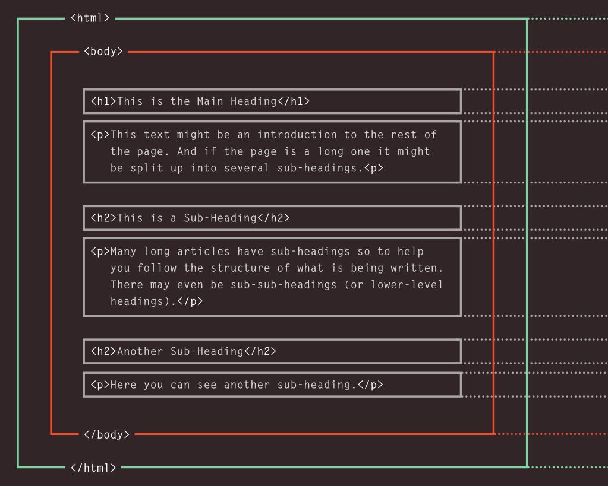

# 01 - Basic Structure of an HTML Page

**Goal:** understand the skeleton every webpage is built on: declaration first, then one root, then metadata, then visible content.

## The full template

```html
<!DOCTYPE html>
<html lang="en">
<head>
  <meta charset="utf-8">
  <meta name="viewport" content="width=device-width, initial-scale=1">
  <title>Your Page Title</title>
</head>
<body>
  <!-- Your page content -->
</body>
</html>
```

Copy this to start **every** page. Read it top to bottom,order matters.

## Tag reference

### `<!DOCTYPE html>` - declaration

- Declares the document as **HTML5** so browsers render in standards mode (not quirks mode).
- **Not a tag**,no closing tag, no attributes. Always the very first line, nothing above it.

```html
<!DOCTYPE html>
```

### `<html>` - root element

- The **parent of everything**. Wraps `<head>` and `<body>`. Needs `</html>` as the last line.
- `lang` sets the page language for **SEO and screen readers**:

```html
<html lang="en">
```

| `lang` value | Meaning |
|--------------|---------|
| `en` | English |
| `sw` | Swahili |
| `fr` | French |

### `<head>` - invisible metadata

- Holds setup the visitor **never sees on the page**: `<title>`, `<meta charset>`, `<meta viewport>`, `<link>` to CSS, `<script>` to JS.
- First child of `<html>`. Always **before** `<body>`.

```html
<head>
  <meta charset="utf-8">
  <meta name="viewport" content="width=device-width, initial-scale=1">
  <title>Bakery</title>
</head>
```

| Tag inside `<head>` | Job |
|---------------------|-----|
| `<title>` | Tab/window title + search-result title |
| `<meta charset="utf-8">` | Character encoding,include always |
| `<meta name="viewport" …>` | Makes mobile browsers scale correctly,include always |

### `<body>` - visible content

- **Everything you see** goes here: headings, paragraphs, lists, images, links, divs.
- Second child of `<html>`. Exactly **one** `<body>` per page.

```html
<body>
  <h1>Bakery</h1>
  <p>Fresh bread daily.</p>
</body>
```

<figure markdown="span">

<figcaption> The struture of an HTML page </figcaption>
</figure>

## Hierarchy (who is inside who)

```text
<!DOCTYPE html>      declaration,comes first, owns nothing
<html>               PARENT,wraps all
  <head>             1st child,invisible setup
  <body>             2nd child,all visible content
```

- `<html>` is the **parent**; `<head>` and `<body>` are its **children**.
- `<head>` always **before** `<body>`. Nothing visible ever goes in `<head>` (except `<title>` on the tab).

## Rules

- One `<!DOCTYPE>`, one `<html>`, one `<head>`, one `<body>`,no more.
- Close tags in reverse order: `<html>` opens second, closes last.
- Forgetting `<meta charset>` can garble non-English characters. Forgetting `viewport` breaks mobile layout.

## Recap

| Order | Tag | Role |
|-------|-----|------|
| 1st | `<!DOCTYPE html>` | Declaration |
| 2nd | `<html lang>` | Root parent |
| 3rd | `<head>` | Invisible metadata |
| 4th | `<body>` | Visible content |

**Next:** [02 - What Are Headings?](02-headings.md)


