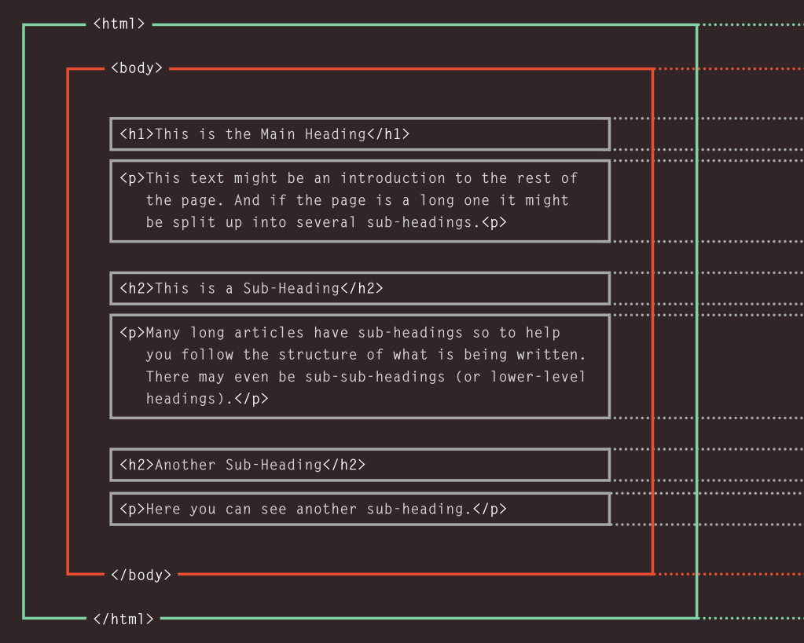

# Basic Structure of an HTML Page

**Goal:** In this chapter you will learn the skeleton on which every webpage is built, starting with the declaration, then the single root element, then the metadata, and finally the visible content.

## The full template

```html
<!DOCTYPE html>
<html lang="en">
<head>
  <meta charset="utf-8">
  <meta name="viewport" content="width=device-width, initial-scale=1">
  <title>Your Page Title</title>
</head>
<body>
  <!-- Your page content -->
</body>
</html>
```

Copy this template at the start of **every** page. Read it from top to bottom, because the order is significant.

## Tag reference

### `<!DOCTYPE html>` - declaration

- This line declares the document as **HTML5** so that browsers render the page in standards mode instead of quirks mode.
- It is **not a tag**, so it has no closing tag and no attributes. It must always be the very first line, with nothing above it.

```html
<!DOCTYPE html>
```

### `<html>` - root element

- The `html` element is the **parent of everything**. It wraps both `<head>` and `<body>`, and its closing tag `</html>` must be the last line of the file.
- The `lang` attribute sets the page language, which **screen readers and search engines use**:

```html
<html lang="en">
```

| `lang` value | Meaning |
|--------------|---------|
| `en` | English |
| `sw` | Swahili |
| `fr` | French |

### `<head>` - invisible metadata

- The `head` element holds setup information which the visitor **never sees on the page itself**, including `<title>`, `<meta charset>`, `<meta viewport>`, `<link>` to CSS, and `<script>` to JS.
- It is the first child of `<html>`, and it always appears **before** `<body>`.

```html
<head>
  <meta charset="utf-8">
  <meta name="viewport" content="width=device-width, initial-scale=1">
  <title>Bakery</title>
</head>
```

| Tag inside `<head>` | Job |
|---------------------|-----|
| `<title>` | The tab and window title, which is also used as the search-result title |
| `<meta charset="utf-8">` | The character encoding, which should always be included |
| `<meta name="viewport" …>` | The instruction which makes mobile browsers scale the page correctly, and which should always be included |

### `<body>` - visible content

- **Everything the visitor sees** belongs in the body, including headings, paragraphs, lists, images, links, and divs.
- It is the second child of `<html>`, and each page contains exactly **one** `<body>` element.

```html
<body>
  <h1>Bakery</h1>
  <p>Fresh bread daily.</p>
</body>
```

<figure markdown="span">

<figcaption> The struture of an HTML page </figcaption>
</figure>

## Hierarchy (who is inside who)

```text
<!DOCTYPE html>      declaration,comes first, owns nothing
<html>               PARENT,wraps all
  <head>             1st child,invisible setup
  <body>             2nd child,all visible content
```

- The `<html>` element is the **parent**, while `<head>` and `<body>` are its **children**.
- The `<head>` element always appears **before** the `<body>` element. No visible content ever belongs in `<head>`, although the `<title>` appears on the browser tab.

## Rules

- Each page contains one `<!DOCTYPE>`, one `<html>`, one `<head>`, and one `<body>`, with no additional copies.
- Close the tags in reverse order, so the `<html>` tag which opens second also closes last.
- If you omit `<meta charset>`, non-English characters can display incorrectly. If you omit the viewport tag, the layout breaks on mobile phones.

## Recap

| Order | Tag | Role |
|-------|-----|------|
| 1st | `<!DOCTYPE html>` | Declaration |
| 2nd | `<html lang>` | Root parent |
| 3rd | `<head>` | Invisible metadata |
| 4th | `<body>` | Visible content |

---

## The Basic Structure of an HTML Element

HTML documents are built from **elements**. An HTML element tells the browser what a particular piece of content represents and how it should be structured.

For example:

```html
<p>Hello, world!</p>
```

This is a paragraph element.

To understand HTML well, you need to understand the different parts that make up an element.

---

### 1. The Basic Pattern

A typical HTML element looks like this:

```html
<element>Content</element>
```

For example:

```html
<p>Hello, world!</p>
```

The element has three main parts:

```text
<p>        Hello, world!        </p>
 │               │                │
 │               │                └── Closing tag
 │               └────────────────── Content
 └────────────────────────────────── Opening tag
```

The complete combination of the opening tag, content, and closing tag is called an **element**.

---

### 2. The Opening Tag

The opening tag tells the browser where an element begins.

For example:

```html
<p>
```

The opening tag consists of:

```text
<   p   >
│   │   │
│   │   └── Closing angle bracket
│   └────── Element name
└────────── Opening angle bracket
```

The element name tells the browser what kind of element it is.

For example:

```html
<p>
```

means paragraph.

```html
<h1>
```

means a level-one heading.

```html
<strong>
```

means strongly important content.

---

### 3. The Content

The content is the information contained inside the element.

For example:

```html
<p>Hello, world!</p>
```

The content is:

```text
Hello, world!
```

Another example:

```html
<h1>Learning HTML</h1>
```

The content is:

```text
Learning HTML
```

The content does not have to be plain text. Some elements can contain other HTML elements.

For example:

```html
<p>
    This is <strong>very important</strong> information.
</p>
```

Here, the `<p>` element contains text as well as a `<strong>` element.

---

### 4. The Closing Tag

The closing tag tells the browser where the element ends.

For example:

```html
</p>
```

Notice the `/`.

Compare:

```html
<p>
```

with:

```html
</p>
```

The `/` indicates that this is the **closing tag**.

The structure is:

```text
<   p   >
│   │   │
│   │   └── Closing angle bracket
│   └────── Element name
└────────── Opening angle bracket
```

For the closing tag:

```text
<   /   p   >
│   │   │   │
│   │   │   └── Closing angle bracket
│   │   └────── Element name
│   └────────── Forward slash
└────────────── Opening angle bracket
```

---

### 5. The Complete Element

When the opening tag, content, and closing tag are combined, we have an HTML element:

```html
<p>Hello, world!</p>
```

We can break it down as:

```text
<p>          → Opening tag

Hello, world! → Content

</p>         → Closing tag
```

Together:

```text
Opening tag + Content + Closing tag = Element
```

---

### 6. Another Example

Consider:

```html
<h1>My Website</h1>
```

It contains:

* `<h1>` → opening tag
* `My Website` → content
* `</h1>` → closing tag
* the entire thing → HTML element

Another example:

```html
<strong>Important information</strong>
```

Here:

```text
<strong>                 Opening tag
Important information    Content
</strong>                Closing tag
```

---

### 7. Elements Can Contain Other Elements

HTML elements can be placed inside other elements. This is called **nesting**.

For example:

```html
<p>
    This is <strong>important</strong> information.
</p>
```

The `<strong>` element is inside the `<p>` element.

The structure can be represented as:

```text
<p>
│
├── This is
│
├── <strong>
│   └── important
│
└── information.
```

This allows us to build more complex documents from simple elements.

---

### 8. Proper Nesting

When elements are nested, they should be closed in the correct order.

Correct:

```html
<p>
    This is <strong>important</strong> information.
</p>
```

The `<strong>` element opens and closes inside the `<p>` element.

Incorrect:

```html
<p>
    This is <strong>important</p> information</strong>
```

The elements overlap incorrectly.

A useful rule is:

> **The last element you open should be the first element you close.**

For example:

```html
<p>
    <strong>
        Important text
    </strong>
</p>
```

The `<strong>` element was opened last, so it is closed first.

---

### 9. Attributes

HTML elements can also have **attributes**.

An attribute provides additional information about an element.

For example:

```html
<a href="https://example.com">Visit Example</a>
```

The basic element is:

```html
<a>Visit Example</a>
```

But the opening tag contains an attribute:

```html
<a href="https://example.com">
```

Here:

```text
<a
│
└── Element name

href
│
└── Attribute name

"https://example.com"
│
└── Attribute value
```

The complete structure is:

```text
<element attribute="value">
    Content
</element>
```

For example:

```html
<a href="https://example.com">
    Visit Example
</a>
```

---

### 10. Multiple Attributes

An element can have multiple attributes.

For example:

```html

```

This element has three attributes:

```text
src   → cat.jpg
alt   → A sleeping cat
width → 400
```

Attributes are written inside the opening tag.

The general pattern is:

```html
<element attribute="value" attribute="value">
    Content
</element>
```

---

### 11. Not Every Element Has a Closing Tag

Some HTML elements do not contain content and therefore do not need a closing tag.

For example:

```html

```

There is no:

```html
</img>
```

The `` element is a **void element**.

Other common void elements include:

```html
<br>
<hr>
<input>
<meta>
<link>
```

For these elements, there is no content between an opening and closing tag.

---

### 12. Element vs Tag

These terms are related but are not exactly the same.

Consider:

```html
<p>Hello</p>
```

The tags are:

```html
<p>
```

and:

```html
</p>
```

The **element** is the entire structure:

```html
<p>Hello</p>
```

So:

> A **tag** is part of an element, while an **element** is the complete structure.

---

### 13. A Complete Example

Consider this:

```html
<p class="introduction">
    Welcome to <strong>HTML</strong>!
</p>
```

We can break it down into:

```text
<p class="introduction">
│ │
│ └── Attribute
│
└── Element name

Welcome to
│
└── Text content

<strong>
│
└── Nested element

HTML
│
└── Content of the <strong> element

</strong>
│
└── Closing tag of the nested element

</p>
│
└── Closing tag of the paragraph
```

The outer element is the paragraph:

```html
<p class="introduction">
    ...
</p>
```

Inside it is another element:

```html
<strong>HTML</strong>
```

This demonstrates how HTML elements can be combined to create structured content.

---

### 14. The General Structure to Remember

For most HTML elements, remember this pattern:

```html
<element attribute="value">
    Content
</element>
```

For example:

```html
<p class="intro">
    Welcome to my website.
</p>
```

Where:

```text
<p>                 Element name
class="intro"       Attribute
Welcome...          Content
</p>                Closing tag
```

But some elements are void elements:

```html
<element attribute="value">
```

For example:

```html

```

---

### Summary

An HTML element can consist of:

```text
Opening tag
     ↓
<element attribute="value">
     ↓
Content
     ↓
Closing tag
     ↓
</element>
```

For example:

```html
<p class="intro">Hello, world!</p>
```

The important concepts are:

| Part            | Purpose                                |
| --------------- | -------------------------------------- |
| Opening tag     | Starts the element                     |
| Element name    | Identifies what the element represents |
| Attribute       | Provides additional information        |
| Attribute value | Gives the attribute its value          |
| Content         | Information contained in the element   |
| Closing tag     | Ends the element                       |

The key distinction to remember is:

**Tags create the boundaries of elements. Elements provide structure and meaning to HTML content.**
