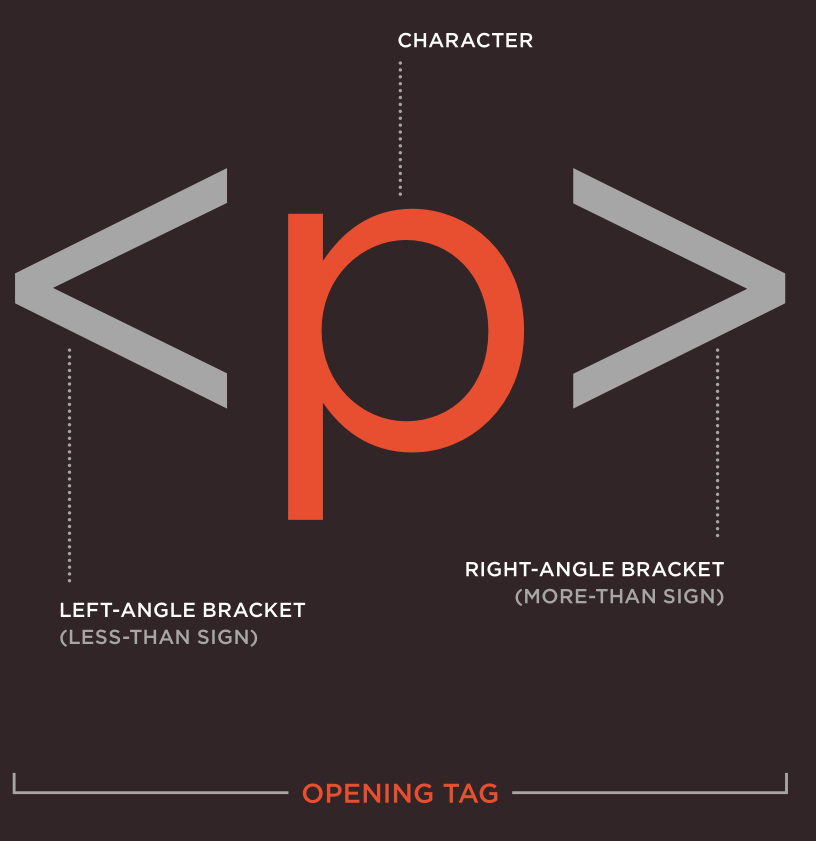
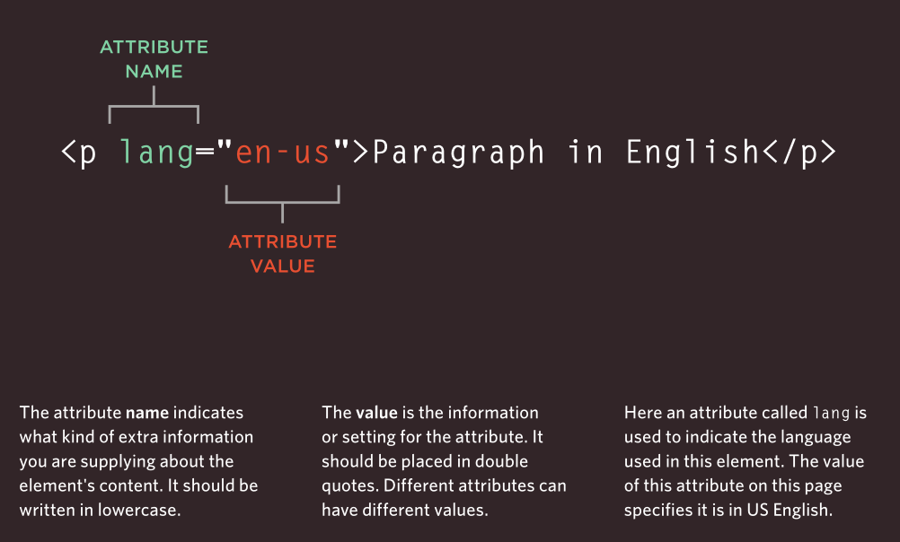

# Basic Structure of an HTML Page

You'll spend a lot of time inside this skeleton, so let's get comfortable with it. Every webpage you build starts the same way: a declaration up top, one root element holding everything, a bit of invisible setup, and then the visible content.

## The full template

Keep this handy — you'll want it at the top of **every** page you create:

```html
<!DOCTYPE html>
<html lang="en">
<head>
  <meta charset="utf-8">
  <meta name="viewport" content="width=device-width, initial-scale=1">
  <title>Your Page Title</title>
</head>
<body>
  <!-- Your page content -->
</body>
</html>
```

Read it top to bottom; the order actually matters.

## Tag reference

### `<!DOCTYPE html>` — declaration

- This first line tells the browser "this is HTML5, so use standards mode." Without it you can end up in quirks mode and wonder why things look odd.
- It's **not a tag**, so there's no closing tag and no attributes. It has to be the very first line — nothing above it, not even a comment.

```html
<!DOCTYPE html>
```

### `<html>` — root element

- Think of `<html>` as the parent of everything. It wraps `<head>` and `<body>`, and its closing tag `</html>` should be the last line in the file.
- The `lang` attribute hints the page language to screen readers and search engines:

```html
<html lang="en">
```

| `lang` value | Meaning |
|--------------|---------|
| `en` | English |
| `sw` | Swahili |
| `fr` | French |

### `<head>` — invisible metadata

- `<head>` holds setup info you **don't see on the page itself** — the tab title, character set, viewport hint, CSS links, JS, and so on. It's the first child of `<html>` and always comes **before** `<body>`.

```html
<head>
  <meta charset="utf-8">
  <meta name="viewport" content="width=device-width, initial-scale=1">
  <title>Bakery</title>
</head>
```

| Tag inside `<head>` | What it does |
|---------------------|--------------|
| `<title>` | Tab/window title — also what shows up in search results |
| `<meta charset="utf-8">` | Character encoding — just include it, always |
| `<meta name="viewport" …>` | Tells mobile browsers how to scale the page — also always include it |

### `<body>` — what visitors actually see

- Headings, paragraphs, lists, images, links — if it's visible, it lives in `<body>`. Each page has exactly **one** `<body>`, and it's the second child of `<html>`.

```html
<body>
  <h1>Bakery</h1>
  <p>Fresh bread daily.</p>
</body>
```

<figure markdown="span">

<figcaption> The structure of an HTML page </figcaption>
</figure>

## Hierarchy (who's inside who)

```text
<!DOCTYPE html>      declaration — comes first, owns nothing
<html>               PARENT — wraps everything
  <head>             1st child — invisible setup
  <body>             2nd child — all visible content
```

- `<html>` is the parent; `<head>` and `<body>` are its children.
- `<head>` always comes before `<body>`. No visible content goes in `<head>` — though `<title>` will show up on the browser tab.

## A few ground rules

- One `<!DOCTYPE>`, one `<html>`, one `<head>`, and one `<body>` per page — no extras.
- Close tags in reverse order. The `<html>` you opened second? It closes last.
- Skip `<meta charset>` and non-English characters can turn to gibberish. Skip the viewport tag and your layout will look broken on phones. We've all been there.

## Quick recap

| Order | Tag | Role |
|-------|-----|------|
| 1st | `<!DOCTYPE html>` | Declaration |
| 2nd | `<html lang>` | Root parent |
| 3rd | `<head>` | Invisible metadata |
| 4th | `<body>` | Visible content |

---

## The Basic Structure of an HTML Element

HTML pages are built from **elements** — labelled chunks that tell the browser what each piece of content *means* and how it should be structured.

Here's a paragraph element:

```html
<p>Hello, world!</p>
```

Simple enough, but there are a few moving parts worth naming.

---

### 1. The Basic Pattern

Most elements look like this:

```html
<element>Content</element>
```

So this:

```html
<p>Hello, world!</p>
```

is really three parts:

```text
<p>        Hello, world!        </p>
 │               │                │
 │               │                └── Closing tag
 │               └────────────────── Content
 └────────────────────────────────── Opening tag
```

Together, those three make an **element**.

---

### 2. The Opening Tag

This tells the browser "start here."

```html
<p>
```

Pulled apart:

```text
<   p   >
│   │   │
│   │   └── Closing angle bracket
│   └────── Element name
└────────── Opening angle bracket
```

<figure markdown="span">

{ width="300" }

<figcaption>An opening tag</figcaption>

</figure>

That name in the middle is the important bit:

```html
<p>
```
→ paragraph.

```html
<h1>
```
→ main heading.

```html
<strong>
```
→ strongly important — not just "make it bold".

---

### 3. The Content

Whatever lives between the tags.

```html
<p>Hello, world!</p>
```

Content:

```text
Hello, world!
```

Another:

```html
<h1>Learning HTML</h1>
```

Content:

```text
Learning HTML
```

And it doesn't have to be plain text — elements can hold other elements too:

```html
<p>
    This is <strong>very important</strong> information.
</p>
```

That paragraph contains text *and* a `<strong>` element.

---

### 4. The Closing Tag

This says "we're done."

```html
</p>
```

See the `/`? That's the clue.

```html
<p>
```
vs.

```html
</p>
```

That slash marks it as the **closing tag**:

```text
<   p   >
│   │   │
│   │   └── Closing angle bracket
│   └────── Element name
└────────── Opening angle bracket
```

and for the closer:

```text
<   /   p   >
│   │   │   │
│   │   │   └── Closing angle bracket
│   │   └────── Element name
│   └────────── Forward slash
└────────────── Opening angle bracket
```

---

### 5. The Complete Element

Put them together:

```html
<p>Hello, world!</p>
```

```text
<p>          → Opening tag

Hello, world! → Content

</p>         → Closing tag
```

In shorthand:

```text
Opening tag + Content + Closing tag = Element
```

---

### 6. Another Example

```html
<h1>My Website</h1>
```

That breaks down to:

* `<h1>` → opening tag
* `My Website` → content
* `</h1>` → closing tag
* the whole thing → HTML element

One more:

```html
<strong>Important information</strong>
```

```text
<strong>                 Opening tag
Important information    Content
</strong>                Closing tag
```

---

### 7. Elements Can Contain Other Elements

Elements inside other elements — that's **nesting**.

```html
<p>
    This is <strong>important</strong> information.
</p>
```

`<strong>` lives inside `<p>`. As a little tree:

```text
<p>
│
├── This is
│
├── <strong>
│   └── important
│
└── information.
```

That's how simple pieces combine into more interesting pages.

---

### 8. Proper Nesting

Close in the right order. Think of packing boxes — you close the inner one before the outer one.

This is fine:

```html
<p>
    This is <strong>important</strong> information.
</p>
```

This isn't:

```html
<p>
    This is <strong>important</p> information</strong>
```

The tags overlap — browsers will guess, but don't make them.

A rule of thumb you'll hear a lot:

> **Last opened, first closed.**

E.g.:

```html
<p>
    <strong>
        Important text
    </strong>
</p>
```

We opened `<strong>` last, so we close it first.

---

### 9. Attributes

Attributes add extra info to an element:

```html
<a href="https://example.com">Visit Example</a>
```

Start from the bare element:

```html
<a>Visit Example</a>
```

Add the detail to the opening tag:

```html
<a href="https://example.com">
```

Breakdown:

```text
<a
│
└── Element name

href
│
└── Attribute name

"https://example.com"
│
└── Attribute value
```

<figure markdown="span">

{ width="300" }

<figcaption>HTML attributes on the opening tag</figcaption>

</figure>

General shape:

```text
<element attribute="value">
    Content
</element>
```

E.g.:

```html
<a href="https://example.com">
    Visit Example
</a>
```

---

### 10. Multiple Attributes

Yep, you can have more than one — just keep them inside the opening tag:

```html

```

That's three:

```text
src   → cat.jpg
alt   → A sleeping cat
width → 400
```

Pattern:

```html
<element attribute="value" attribute="value">
    Content
</element>
```

---

### 11. Not Every Element Has a Closing Tag

Some elements never wrap content, so they don't need a closer:

```html

```

No `</img>` — we'd call this a **void element**.

Common ones you'll see:

```html
<br>
<hr>
<input>
<meta>
<link>
```

No content between tags, just the element on its own.

---

### 12. Element vs Tag — Not Quite the Same

Take:

```html
<p>Hello</p>
```

Tags are:

```html
<p>
```

and:

```html
</p>
```

The **element** is the whole bundle:

```html
<p>Hello</p>
```

Short version:

> A tag is a marker; an element is the complete structure (tags + content).

---

### 13. A Complete Example

```html
<p class="introduction">
    Welcome to <strong>HTML</strong>!
</p>
```

Unpacked:

```text
<p class="introduction">
│ │
│ └── Attribute
│
└── Element name

Welcome to
│
└── Text content

<strong>
│
└── Nested element

HTML
│
└── Content of the <strong> element

</strong>
│
└── Closing tag of the nested element

</p>
│
└── Closing tag of the paragraph
```

Outer wrapper is the paragraph:

```html
<p class="introduction">
    ...
</p>
```

Inside it:

```html
<strong>HTML</strong>
```

Each bit has a clear job.

---

### 14. The General Structure to Remember

Most elements you'll write:

```html
<element attribute="value">
    Content
</element>
```

E.g.:

```html
<p class="intro">
    Welcome to my website.
</p>
```

Where:

```text
<p>                 Element name
class="intro"       Attribute
Welcome...          Content
</p>                Closing tag
```

Void elements break the rule:

```html
<element attribute="value">
```

E.g.:

```html

```

---

### Summary

Picture it like this:

```text
Opening tag
     ↓
<element attribute="value">
     ↓
Content
     ↓
Closing tag
     ↓
</element>
```

For example:

```html
<p class="intro">Hello, world!</p>
```

At a glance:

| Part            | What it does                        |
| --------------- | ----------------------------------- |
| Opening tag     | Kicks the element off               |
| Element name    | Says what kind of element it is     |
| Attribute       | Adds extra info                     |
| Attribute value | The value for that attribute        |
| Content         | Whatever's inside                   |
| Closing tag     | Wraps it up                         |

If you remember one line:

**Tags are the brackets. Elements are the meaningful chunks those brackets create.**
