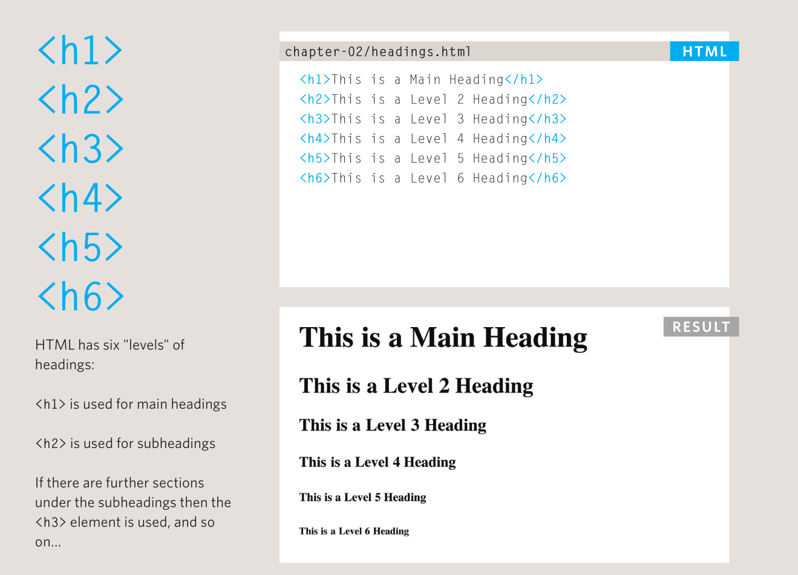

# 03 - Headings h1–h6 Showcase

**Goal:** meet all six heading levels and see their relative sizes.

## The rule first

There must be one `<h1>` per page. Never skip heading levels 1 to 3.

## All six levels

| Tag | Renders (approx.) | Use for |
|-----|-------------------|---------|
| `<h1>` | **Bakery Homepage** (largest) | Page title,once |
| `<h2>` | **Our Menu** | Major sections |
| `<h3>` | **Drinks** | Subsections |
| `<h4>` | **Hot Drinks** | Sub-subsections |
| `<h5>` | **Tea Notes** | Deep detail |
| `<h6>` | **Fine print head** (smallest) | Rarely,deepest level |

## Snippets

```html
<h1>Bakery</h1>
<h2>Our Menu</h2>
<h3>Drinks</h3>
<h4>Hot Drinks</h4>
<h5>Tea Notes</h5>
<h6>Fine print head</h6>
```

A correctly nested example,note no skipped levels:

```html
<h1>Bakery</h1>
<h2>Our Menu</h2>
<h3>Drinks</h3>
<h2>Prices</h2>
```

## Gotchas

- Two `<h1>` tags on one page: split the page or demote one to `<h2>`.
- `<h1>` followed directly by `<h3>`: insert the missing `<h2>`, even if it feels redundant.
- Styling a paragraph to look big is **not** a heading,screen readers won't list it.

<figure markdown="span">

{ width="400" }

<figcaption>Headings</figcaption>

</figure>


## Recap

| Level | Size hint | Role |
|-------|-----------|------|
| `h1` | Biggest | Page title ×1 |
| `h2` | Large | Sections |
| `h3`–`h6` | Shrinking | Subsections, never skipped |

**Next:** [04,What Are Paragraphs?](04-paragraphs.md) · **Prev:** [02,What Are Headings?](02-headings.md)
