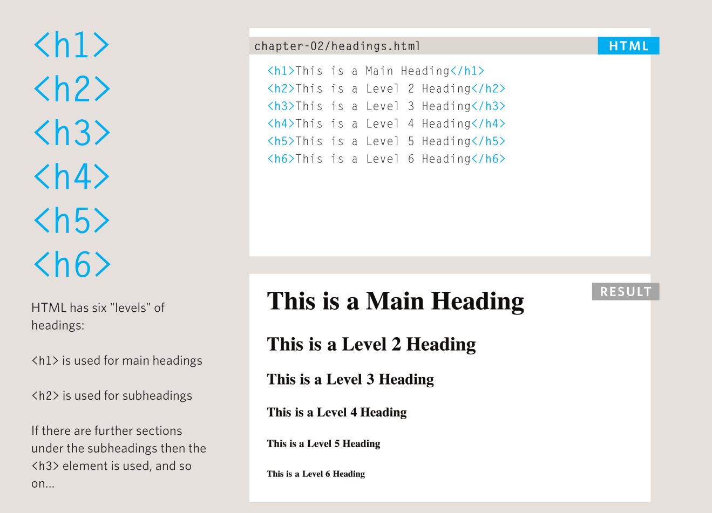

# Headings h1–h6 Showcase

You'll meet all six heading levels here and see how they stack up, not just how big they look, but when you'd actually reach for each one.

## The rule to carry with you

Every page should have one `<h1>`, that's the page's title. And don't skip levels just because you like the default size (jumping straight from `<h1>` to `<h3>` is a giveaway you picked for looks, not structure).

## All six levels

| Tag | Rough default look | When you'd use it |
|-----|-------------------|-------------------|
| `<h1>` | **Bakery Homepage** (largest) | Page title: once per page |
| `<h2>` | **Our Menu** | Major sections |
| `<h3>` | **Drinks** | Subsections inside an h2 |
| `<h4>` | **Hot Drinks** | Deeper nesting |
| `<h5>` | **Tea Notes** | Fine detail you'll rarely need |
| `<h6>` | **Fine print head** (smallest) | Deepest level, used sparingly |

## Snippets

```html
<h1>Bakery</h1>
<h2>Our Menu</h2>
<h3>Drinks</h3>
<h4>Hot Drinks</h4>
<h5>Tea Notes</h5>
<h6>Fine print head</h6>
```

Here's what correct nesting looks like, no levels skipped:

```html
<h1>Bakery</h1>
<h2>Our Menu</h2>
<h3>Drinks</h3>
<h2>Prices</h2>
```

`<h2>` → `<h3>` is fine; `<h1>` → `<h3>` without an `<h2>` isn't ideal.

## A few habits to avoid

- Two `<h1>`s on one page? Split it into two pages or demote one to `<h2>`.
- `<h1>` followed immediately by `<h3>`? Slip in that missing `<h2>`: even if it feels a bit redundant.
- A paragraph styled to look huge is **not** a heading. Screen readers won't list it, and your outline breaks.

<figure markdown="span">

{ width="400" }

<figcaption>Headings</figcaption>

</figure>


## Quick recap

| Level | Size hint | Role |
|-------|-----------|------|
| `h1` | Biggest | Page title, once |
| `h2` | Large | Sections |
| `h3`–`h6` | Shrinking | Subsections: don't skip |
