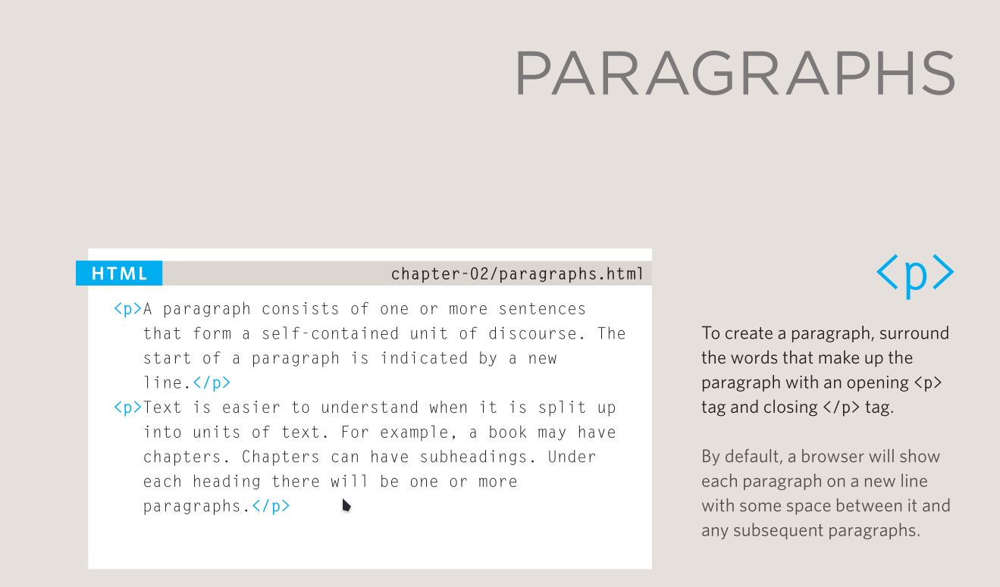

# 04 - What Are Paragraphs?

**Goal:** understand paragraphs as blocks of thought,and how `br` and `hr` differ.

## Paragraphs = blocks of thought

A paragraph groups sentences into **one block, one idea**. It is the default unit of web text:

```html
<p>Fresh bread baked every morning.</p>
```

- **Block-level:** each `<p>` starts on a new line, and browsers add space above and below automatically.
- **Readability:** one idea per `<p>`. Short paragraphs scan far better on screens than walls of text.

## `<p>` vs `<br>`

- `<p>` = a **new thought**,a new block.
- `<br>` = a line break **inside the same thought**,an address, a poem, a signature block:

```html
<p>Line one<br>Line two, same thought</p>
```

<figure markdown="span">

{ width="400" }

<figcaption>Paragraphs</figcaption>

</figure>


**Never** stack `<br><br><br>` to fake paragraph spacing. That is what `<p>` (and CSS margins) are for,stacked breaks mean nothing to screen readers.

## `<hr>` = thematic break

`<hr>` marks a **scene change** between blocks,a new scene in a story, menu switching to prices:

```html
<p>Menu</p>
<hr>
<p>Prices</p>
```

It renders as a horizontal line, but its meaning is "the topic shifts here",it is **not** decoration.

## Rules

1. One idea per `<p>`; keep them short.
2. `<br>` is an empty tag,no closing tag, use sparingly.
3. `<hr>` is an empty tag,a topic shift, not a divider graphic.

## Recap

| Tag | Meaning | Empty? |
|-----|---------|--------|
| `p` | Block of thought | No |
| `br` | Line break, same thought | Yes |
| `hr` | Thematic break | Yes |

**Next:** [05,Paragraphs, Breaks, Rules](05-paragraphs-snippets.md) · **Prev:** [03,Headings h1–h6](03-headings-showcase.md)
