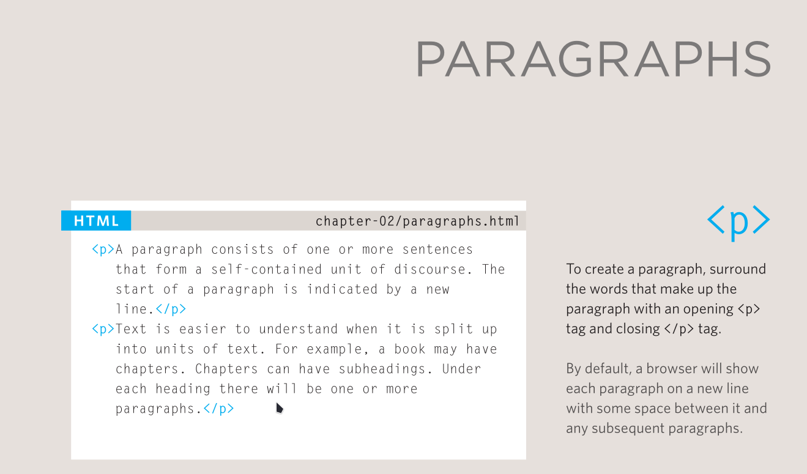

# What Are Paragraphs?

Paragraphs are **blocks of thought** — one idea per block. That's it. It's the default way we chunk text on the web:

```html
<p>Fresh bread baked every morning.</p>
```

- **Block-level:** Each `<p>` starts on a new line, and browsers add a little breathing room above and below automatically.
- **Readability:** One idea per `<p>`. Short paragraphs scan so much better on a phone than a wall of text — try reading both and you'll feel it.

## `<p>` vs `<br>`

- `<p>` starts a **new thought** — a new block.
- `<br>` just breaks the line **inside the same thought** — handy for an address, a poem, or a signature block, not for essays:

```html
<p>Line one<br>Line two, same thought</p>
```

<figure markdown="span">

{ width="400" }

<figcaption>Paragraphs</figcaption>

</figure>

Don't be tempted to stack breaks like `<br><br><br>` to fake paragraph spacing — it's the classic lab slip-up we see at Migadde. Use `<p>` plus CSS margins instead. Stacked breaks carry no meaning for screen readers, either.

## `<hr>` = thematic break

`<hr>` signals a **scene change** — when a story jumps to a new scene, or a menu flips to prices:

```html
<p>Menu</p>
<hr>
<p>Prices</p>
```

It happens to render as a horizontal line, but its job is semantic: "topic shifts here." Not decoration.

## Quick habits

1. One idea per `<p>` — keep them short.
2. `<br>` is an empty tag (no closing tag) — use it sparingly, inside a paragraph.
3. `<hr>` is also empty — it marks a shift in topic, not a pretty divider.

## Recap

| Tag | Meaning | Empty? |
|-----|---------|--------|
| `p` | Block of thought | No |
| `br` | Line break within the same thought | Yes |
| `hr` | Thematic break | Yes |
