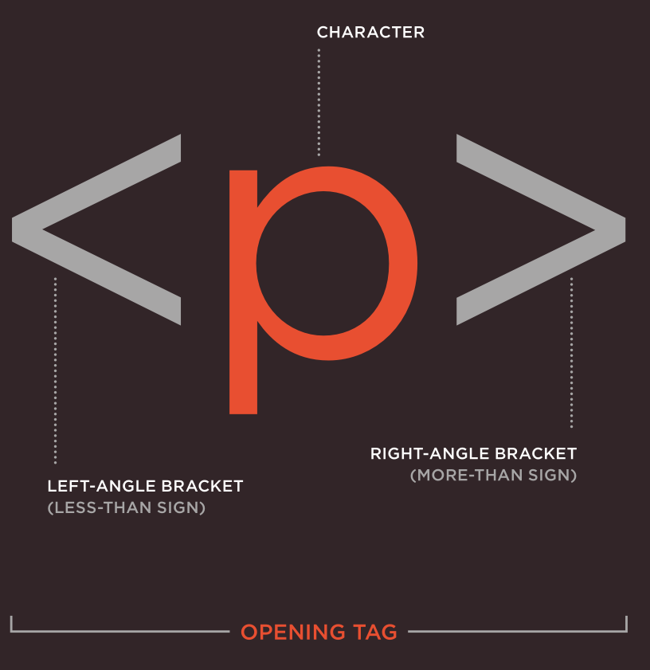
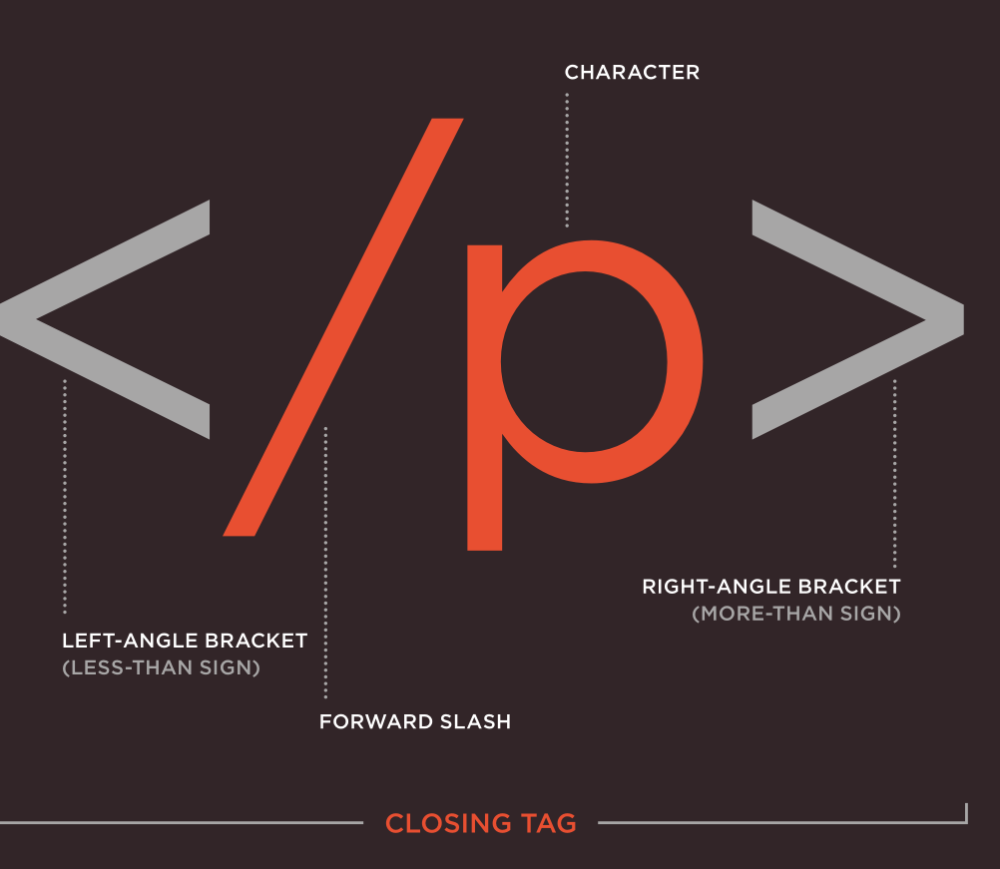
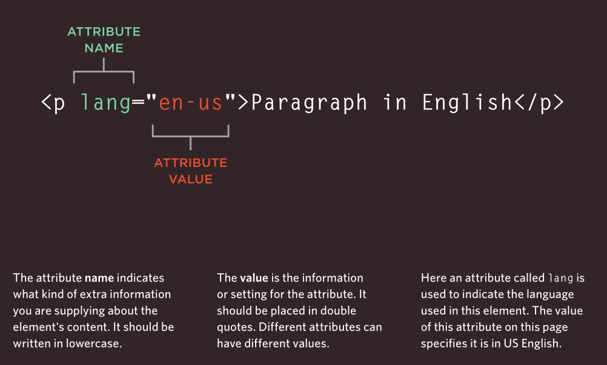

# Intro to HTML,What HTML Is

**Goal:** understand what HTML is, what it does, and how you write and save it,before you write your first page.

## What is HTML?

**HTML = HyperText Markup Language.**

- **HyperText**,text that can link to other text. A page that can point to another page via links.
- **Markup**,you *mark up* plain text with labels that say what each part *is*.
- **Language**,a fixed set of labels (called *tags*) that every browser understands.

HTML is **not a programming language**. It has no logic, no variables, no `if` statements. It is a **markup language**: it describes the *structure and meaning* of content.

## What does HTML do?

HTML tells the browser **what things are**, not what they look like.

```html
<h1>Bakery</h1>
<p>Fresh bread daily.</p>
```

- `<h1>Bakery</h1>`,"this is the main title of the page."
- `<p>Fresh bread daily.</p>`,"this is a paragraph."

The browser then decides how to show that: big bold title, plain paragraph. Exact colours, fonts, and layout come later with **CSS**. Behaviour and interactivity come later with **JavaScript**.

| Technology | Job | Example |
|------------|-----|---------|
| **HTML** | Structure and meaning | "This is a heading, this is a paragraph, this is a link." |
| **CSS** | Looks and layout | "Make the heading red and centred." |
| **JavaScript** | Behaviour | "When clicked, show the menu." |

This course covers **HTML only**. One core rule to carry with you: **choose tags by meaning, never by looks.**

## Tags vs elements

Beginners mix these up. They are different:

- A **tag** is the label in angle brackets: `<p>`, `</p>`, `<h1>`.
- An **element** is the *whole unit*: opening tag + content + closing tag.

<figure markdown="span">

{ width="300" }

<figcaption>An opening tag</figcaption>

</figure>

<figure markdown="span">

{ width="300" }

<figcaption>A closing tag</figcaption>

</figure>

Most elements have both tags:

```html
<h1>Bakery</h1>      <!-- opening <h1>, text, closing </h1> -->
<p>Fresh bread.</p>  <!-- opening <p>, text, closing </p> -->
```

A few elements have **no content and no closing tag**. These are called **void (empty) elements**:

```html
<br>   <!-- line break -->
<hr>   <!-- horizontal rule -->
  <!-- image -->
```

## Attributes
Attributes provide additional information about the contents of an element. They appear on the opening tag of the element and are made up of two parts: a name and a value, separated by an equals sign.

<figure markdown="span">

{ width="300" }

<figcaption>A closing tag</figcaption>

</figure>

!!! note "The pattern to notice"
    Opening tags can carry extra info called **attributes** (like `src` and `alt` above). Closing tags never do. You will meet each attribute when its chapter arrives,for now just recognise the shape.

## How HTML is stored, written, and saved

1. **HTML is plain text.** No special software creates it. It is just characters in a file.
2. **You write it in a text editor**,VS Code, Notepad, TextEdit, anything that saves plain text. Do **not** use Word or Google Docs: they add hidden formatting that breaks HTML.
3. **You save it with an `.html` ending**, for example `index.html`. The `.html` tells the operating system and browser "read this as a webpage."
4. **You open it in a browser**,double-click the file, or drag it into Chrome/Firefox/Edge. The browser reads the file top to bottom and draws the page.

```text
you type (index.html)  →  browser reads  →  page you see
<h1>Bakery</h1>            understands        BIG TITLE
<p>Fresh bread.</p>        "title + para"     plain paragraph
```

Practical rules for this course:

- Save every exercise as `index.html` in its own folder.
- Always use **UTF-8 encoding** (your editor's default). This keeps characters like `é`, `ñ`, `ü` intact.
- Name files in **lowercase, no spaces**: `index.html`, not `My Page.HTML`.
- After every change: **save the file, then refresh the browser**. No save = no change on screen.

You do not need a server, the internet, or any build tool yet. A text file + a browser is the whole setup.

## Try it: your first 3 lines

1. Open your editor, create a new file.
2. Type exactly this:

```html
<h1>Bakery</h1>
<p>Fresh bread daily.</p>
```

3. Save it as `index.html`.
4. Open it in a browser.

You just wrote HTML: two elements, four tags, one title and one paragraph. Everything from here on is more labels for more kinds of content.

## Recap

| Idea | Detail |
|------|--------|
| What HTML is | HyperText Markup Language,labels for structure and meaning |
| What it does | Says what content *is*; browser renders it; CSS handles looks, JS handles behaviour |
| Tag | The bracketed label: `<p>`, `</p>` |
| Element | Whole unit: opening tag + content + closing tag (or a lone void element like `<br>`) |
| How it lives | Plain-text `.html` file, written in a code editor, opened in a browser |

**Next:** [Course Index](00-index.md),how the course is organised, then [01,Basic Structure](01-basic-structure.md).
