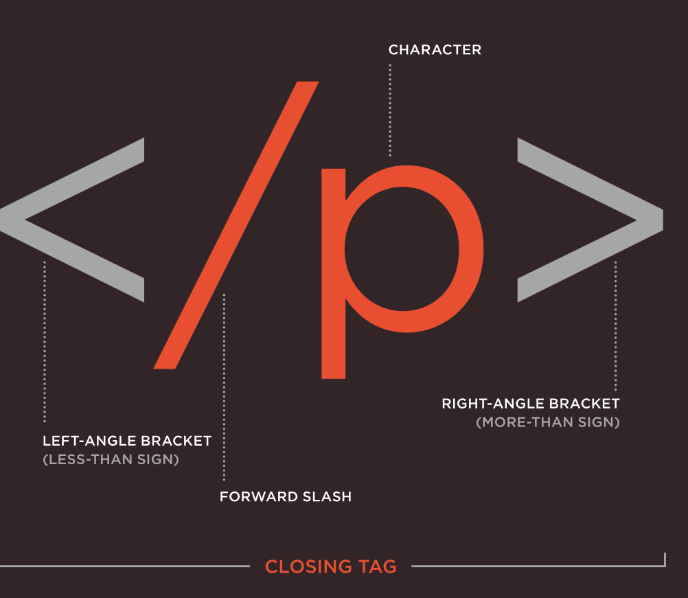

# The Basic Structure of an HTML Element

HTML pages are built from **elements** — small labelled chunks that tell the browser what each bit of content actually *is*, not just how it looks.

Say you write:

```html
<p>Hello, world!</p>
```

That's a paragraph element. Nothing fancy, but if you get how it's put together, the rest of HTML clicks pretty quickly.

---

## 1. The Basic Pattern

Most elements follow this shape:

```html
<element>Content</element>
```

So this:

```html
<p>Hello, world!</p>
```

is really three pieces working together:

```text
<p>        Hello, world!        </p>
 │               │                │
 │               │                └── Closing tag
 │               └────────────────── Content
 └────────────────────────────────── Opening tag
```

Put those three together and you've got an **element**.

---

## 2. The Opening Tag

This is where the browser learns "an element starts here."

```html
<p>
```

If we pull it apart:

```text
<   p   >
│   │   │
│   │   └── Closing angle bracket
│   └────── Element name
└────────── Opening angle bracket
```

<figure markdown="span">

{ width="300" }

<figcaption>An opening tag</figcaption>

</figure>

The name in the middle is what matters — it says what kind of element you're opening. For instance:

```html
<p>
```
that's a paragraph. 

```html
<h1>
```
that's the main heading.

```html
<strong>
```
that's strongly important text — not just "bold for looks".

---

## 3. The Content

This is simply what's *inside* the element.

```html
<p>Hello, world!</p>
```

The content there is:

```text
Hello, world!
```

Another one:

```html
<h1>Learning HTML</h1>
```

Content:

```text
Learning HTML
```

And content isn't always just plain text. You can tuck other elements inside too:

```html
<p>
    This is <strong>very important</strong> information.
</p>
```

Here the paragraph holds both text and a `<strong>` element.

---

## 4. The Closing Tag

Same idea, but it says "we're done."

```html
</p>
```

Spot the `/`? That's the giveaway.

Compare:

```html
<p>
```

with:

```html
</p>
```

That slash marks it as the **closing tag**:

```text
<   p   >
│   │   │
│   │   └── Closing angle bracket
│   └────── Element name
└────────── Opening angle bracket
```

vs.

```text
<   /   p   >
│   │   │   │
│   │   │   └── Closing angle bracket
│   │   └────── Element name
│   └────────── Forward slash
└────────────── Opening angle bracket
```

<figure markdown="span">

{ width="300" }

<figcaption>A closing tag</figcaption>

</figure>

---

## 5. The Complete Element

When you combine the three, you get the full package:

```html
<p>Hello, world!</p>
```

Broken down:

```text
<p>          → Opening tag

Hello, world! → Content

</p>         → Closing tag
```

Or more simply:

```text
Opening tag + Content + Closing tag = Element
```

---

## 6. Another Example

Take:

```html
<h1>My Website</h1>
```

That gives us:

* `<h1>` — opening tag
* `My Website` — content
* `</h1>` — closing tag
* all of it together — an HTML element

One more, just to lock it in:

```html
<strong>Important information</strong>
```

```text
<strong>                 Opening tag
Important information    Content
</strong>                Closing tag
```

---

## 7. Elements Can Contain Other Elements

Elements can live inside other elements — we call it **nesting**.

```html
<p>
    This is <strong>important</strong> information.
</p>
```

The `<strong>` sits inside the `<p>`. If you sketch it as a tree:

```text
<p>
│
├── This is
│
├── <strong>
│   └── important
│
└── information.
```

That's how you build more interesting pages from simple pieces.

---

## 8. Proper Nesting

When you nest, close in the right order. Ever closed a box before putting the lid on inside?

This works:

```html
<p>
    This is <strong>important</strong> information.
</p>
```

The `<strong>` opens and closes entirely inside `<p>`.

This doesn't:

```html
<p>
    This is <strong>important</p> information</strong>
```

They're overlapping — browsers will try to guess what you meant, but don't make them.

A handy rule of thumb:

> **Last opened, first closed.**

Like this:

```html
<p>
    <strong>
        Important text
    </strong>
</p>
```

We opened `<strong>` last, so we close it first.

---

## 9. Attributes

Elements can carry **attributes** — extra info about that element.

```html
<a href="https://example.com">Visit Example</a>
```

Start from a bare element:

```html
<a>Visit Example</a>
```

Now add detail to its opening tag:

```html
<a href="https://example.com">
```

Here:

```text
<a
│
└── Element name

href
│
└── Attribute name

"https://example.com"
│
└── Attribute value
```

<figure markdown="span">

{ width="300" }

<figcaption>HTML attributes on the opening tag</figcaption>

</figure>

In general:

```text
<element attribute="value">
    Content
</element>
```

For instance:

```html
<a href="https://example.com">
    Visit Example
</a>
```

---

## 10. Multiple Attributes

Yep, you can have more than one — just keep them inside the opening tag:

```html

```

That one carries three:

```text
src   → cat.jpg
alt   → A sleeping cat
width → 400
```

Pattern:

```html
<element attribute="value" attribute="value">
    Content
</element>
```

---

## 11. Not Every Element Has a Closing Tag

Some elements don't wrap content at all, so they don't need a closer.

```html

```

There's no `</img>` — it wouldn't make sense. We call it a **void element**.

You'll see a few others a lot:

```html
<br>
<hr>
<input>
<meta>
<link>
```

No content between tags, just the element itself.

---

## 12. Element vs Tag — Not Quite the Same

Take:

```html
<p>Hello</p>
```

The *tags* are:

```html
<p>
```

and:

```html
</p>
```

The **element** is the whole thing:

```html
<p>Hello</p>
```

So simply:

> A tag is a marker; an element is the complete structure (tags + content).

---

## 13. A Complete Example

Let's unpack this:

```html
<p class="introduction">
    Welcome to <strong>HTML</strong>!
</p>
```

```text
<p class="introduction">
│ │
│ └── Attribute
│
└── Element name

Welcome to
│
└── Text content

<strong>
│
└── Nested element

HTML
│
└── Content of the <strong> element

</strong>
│
└── Closing tag of the nested element

</p>
│
└── Closing tag of the paragraph
```

The outer wrapper is the paragraph:

```html
<p class="introduction">
    ...
</p>
```

Inside it sits:

```html
<strong>HTML</strong>
```

Nested, tidy, and each bit has a job.

---

## 14. The General Structure to Remember

For most elements you'll use:

```html
<element attribute="value">
    Content
</element>
```

Like:

```html
<p class="intro">
    Welcome to my website.
</p>
```

Where:

```text
<p>                 Element name
class="intro"       Attribute
Welcome...          Content
</p>                Closing tag
```

Void elements are the exception:

```html
<element attribute="value">
```

Example:

```html

```

---

## Summary

Think of it like this:

```text
Opening tag
     ↓
<element attribute="value">
     ↓
Content
     ↓
Closing tag
     ↓
</element>
```

E.g.:

```html
<p class="intro">Hello, world!</p>
```

Quick recap:

| Part            | What it does                           |
| --------------- | -------------------------------------- |
| Opening tag     | Kicks the element off                  |
| Element name    | Says what kind of element it is        |
| Attribute       | Adds extra info                        |
| Attribute value | The value for that attribute           |
| Content         | Whatever's inside                      |
| Closing tag     | Wraps it up                            |

If you remember one line, make it this:

**Tags are the brackets. Elements are the meaningful chunks those brackets create.**
